<!-- Version & Release -->


<!-- Stack -->


<!-- Infrastructure -->


<!-- Observability & Standards -->


<!-- Security & Compliance -->


# DeepTrace — LLM Service Mesh & Observability Platform

> Real-time observability layer for agentic AI systems. Intercept, trace, visualize, and secure every LLM inference and tool invocation across your agent swarm.

---

## Architecture

```
┌─────────────────────────────────────────────────────────────────┐
│                        DeepTrace Stack                          │
├──────────────┬───────────────────┬───────────────┬──────────────┤
│  Python SDK  │  FastAPI          │  Neo4j        │  React UI    │
│  (Middleware)│  Collector        │  Graph Engine │  Dashboard   │
│              │  + Kafka Consumer │  + ClickHouse │              │
└──────────────┴───────────────────┴───────────────┴──────────────┘
```

### Components

| Component | Path | Purpose |
|-----------|------|---------|
| **SDK** | `sdk/` | Python decorator/middleware for LangChain, CrewAI, AutoGen |
| **Collector** | `collector/` | FastAPI ingest server + Kafka consumer |
| **Graph Engine** | `graph_engine/` | Neo4j driver, ClickHouse writer, anomaly detection |
| **Frontend** | `frontend/` | React + D3/Canvas topology dashboard |
| **Docker** | `docker/` | Compose stack for all services |

---

## Quick Start

### 1. Start the infrastructure
```bash
cd docker
docker compose up -d
```

### 2. Start the collector
```bash
cd collector
pip install -r requirements.txt
uvicorn main:app --host 0.0.0.0 --port 8080 --reload
```

### 3. Start the frontend
```bash
cd frontend
npm install
npm run dev
```

### 4. Instrument your agents
```python
from deeptrace import DeepTrace, TraceConfig

dt = DeepTrace(TraceConfig(endpoint="http://localhost:8080"))

@dt.agent(name="MyAgent", roles=["CodeAudit", "FileRead"])
class MyAgent:
    def run(self, task: str) -> str:
        ...
```

---

## Features

- **Live Topology Graph** — Force-directed agent mesh with real-time latency coloring
- **Token Intensity** — Node size + ring arc visualizing token budget pressure
- **Time-Travel Debugger** — Scrub through execution history, diff context windows
- **Security Heatmap** — Agent × Resource permission matrix with anomaly detection
- **Zero-Trust Enforcement** — Policy engine blocking unauthorized tool invocations
- **Hot Patching** — Inject system prompt updates to running agents without restart
- **Forensic Tagging** — Merkle tree hashes on every tool invocation for audit trails
- **Context Fragmentation Detection** — Alert when >30% context lost between agents

---

## Environment Variables

| Variable | Default | Description |
|----------|---------|-------------|
| `DEEPTRACE_ENDPOINT` | `http://localhost:8080` | Collector API URL |
| `NEO4J_URI` | `bolt://localhost:7687` | Graph database |
| `NEO4J_USER` | `neo4j` | Neo4j username |
| `NEO4J_PASSWORD` | `deeptrace` | Neo4j password |
| `CLICKHOUSE_HOST` | `localhost` | ClickHouse host |
| `CLICKHOUSE_PORT` | `9000` | ClickHouse port |
| `KAFKA_BROKERS` | `localhost:9092` | Kafka bootstrap servers |
| `REDIS_URL` | `redis://localhost:6379` | Redis for live pub/sub |
| `JWT_SECRET` | *(required)* | Auth token signing secret |

---

## License

MIT — Built for production AI systems requiring enterprise-grade observability.
